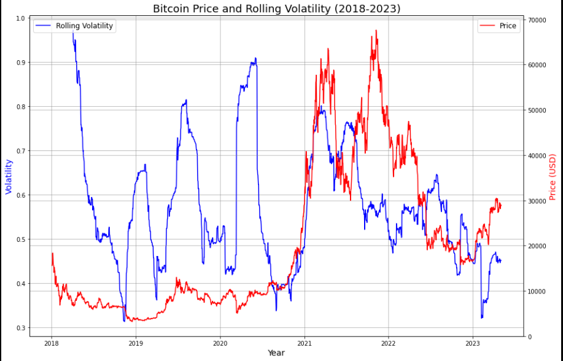

# Price Rolling Vol Indicator

The following code creates a simple graph showing the 90 day rolling volatility of Bitcoin overlayed with the price of Bitcoin between 2018-2023. The spikes in volatility have often preceded 'bottoms' in the market. You can see the spikes preceding the bottom in 2019 as well as prior to the Covid sell off. 

---
